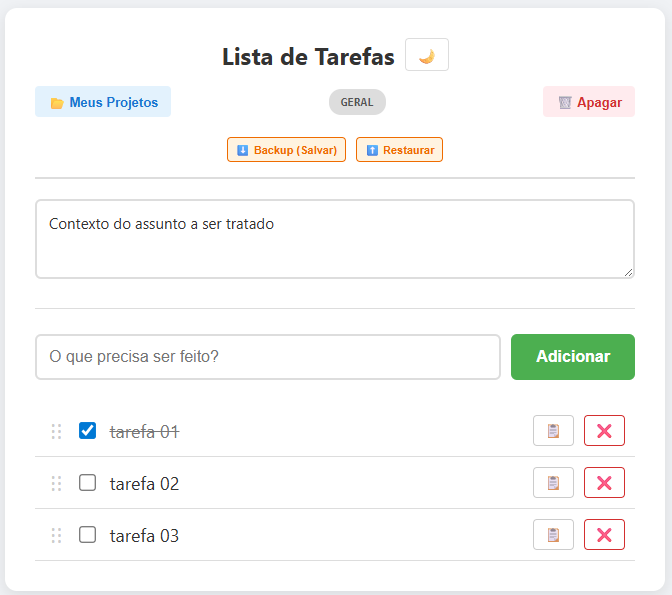
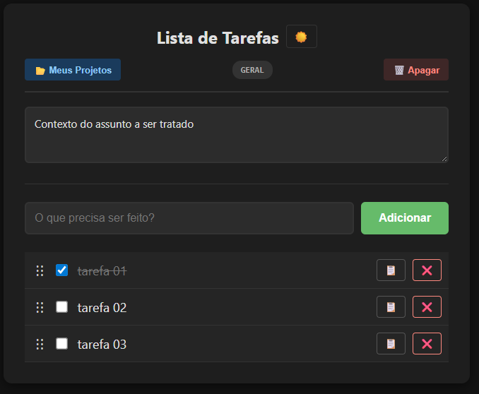

# ✅ Task-in-Browser

> Um gerenciador de tarefas poderoso, persistente e sem servidor, contido em um único arquivo HTML.

O **Task-in-Browser** é uma ferramenta de produtividade minimalista projetada para quem precisa de foco e agilidade. Ele roda inteiramente no navegador do cliente (Client-Side), utilizando `localStorage` para persistir seus dados. Não requer instalação, backend ou login.

## 🚀 Funcionalidades (Features)

* **⚡ Ultraleve:** Um único arquivo HTML com menos de 20kb.
* **🌳 Sub-tarefas (Hierarquia):** Quebre tarefas complexas em etapas menores usando o botão `+`.
* **🌙 Modo Escuro (Dark Mode):** Alternância instantânea de tema com persistência de preferência.
* **🛡️ Backup & Restore:** Sistema completo de Exportação e Importação (JSON) para segurança dos seus dados.
* **🗂️ Múltiplos Contextos (Projetos):** Crie listas separadas dinamicamente via URL (ex: `?id=trabalho`, `?id=pessoal`).
* **📋 Copiar Rápido:** Botão dedicado para copiar o conteúdo da tarefa para a área de transferência com um clique.
* **💾 Persistência Automática:** Seus dados são salvos no navegador em tempo real.
* **🖱️ Drag-and-Drop:** Reorganize suas prioridades arrastando e soltando as tarefas principais.
* **📝 Área de Contexto:** Um bloco de notas dedicado para cada lista (metas, observações, rascunhos).
* **📂 Dashboard de Projetos:** Um menu visual para navegar entre todas as suas listas ativas.
* **🔐 Privacidade Total:** Os dados ficam no seu dispositivo, nada é enviado para a nuvem.

## 🛠️ Como Usar

### 1. Acesso Rápido
Basta baixar o arquivo `index.html` e abri-lo em qualquer navegador moderno (Chrome, Edge, Firefox, Brave).

### 2. Gerenciando Múltiplas Listas
O Task-in-Browser utiliza parâmetros de URL para separar seus ambientes.

* **Lista Geral:** Abra o arquivo normalmente.
* **Nova Lista:** Adicione `?id=NOME_DA_LISTA` ao final da URL.
    * Exemplo: `.../index.html?id=bugs`
    * Exemplo: `.../index.html?id=roadmap`

### 3. Navegação
Use o botão **📂 Meus Projetos** no topo da página para ver todas as listas que você já criou e alternar entre elas rapidamente.

## ⚠️ Segurança de Dados e Backup

Como este aplicativo utiliza o `localStorage` do navegador, seus dados vivem no seu dispositivo. Para garantir que você não perca nada ao formatar o PC ou limpar o histórico:

1.  Clique no botão **⬇️ Backup** no topo da página.
2.  Guarde o arquivo `.json` gerado em um local seguro (Google Drive, Email, etc).
3.  Para recuperar, use o botão **⬆️ Restaurar** e selecione o arquivo.

## 📦 Instalação (Opcional - GitHub Pages)

Para acessar suas tarefas de qualquer lugar (celular/desktop), recomenda-se hospedar este arquivo gratuitamente no **GitHub Pages**:

1.  Faça um fork ou clone deste repositório.
2.  Vá em **Settings** > **Pages**.
3.  Selecione a branch `main` e salve.
4.  Acesse via: `https://seu-usuario.github.io/task-in-browser/`

## 🤝 Contribuindo

Sinta-se à vontade para fazer um fork e submeter Pull Requests.

**Roadmap de Desenvolvimento:**
- [x] Múltiplas Listas (Contextos).
- [x] Drag and Drop.
- [x] Persistência Local.
- [x] Modo Escuro (Dark Mode).
- [x] Exportar/Importar dados (JSON).
- [x] Botão de Copiar (Clipboard).
- [x] Sub-tarefas (Nested lists).
- [ ] Tags/Etiquetas coloridas (Future).

---
*Desenvolvido com ❤️, JavaScript Puro e muito Vibe Coding.*
